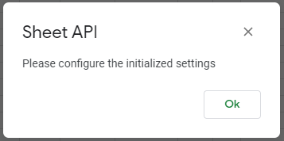

# Configuration

## Initialize Settings

You might need some modifications to let Sheet API match your needs. This can be done by changing some Sheet API settings. 

- Open Google Sheets
- Select **Sheet API** > **Initialize Settings** menu item.
- You will see the dialog shown here when it is completed.

- To edit the settings, select the **File** > **Project properties** menu item in the script editor.
- In the **Project properties** dialog, switch to **Script properties** tab

| Property           | Default Value  | Description                                                          |
| -------------------|----------------| ---------------------------------------------------------------------|
| app.name           | Sheet API      | The name of app which is also the name of added menu in Google Sheet |
| app.version        | 1.0.0          | The version of REST API, used with Swagger specification             |
| app.logLevel       | 1              | Min log level 0: Debug; 1: Info; 2: Error                            |
| app.defaultRole    | anonymous      | The default role will be applied when no apiKey included             |
| app.query.limit    | 20             | The number of items returned by GET action for all resources         |
| app.query.no_format| 1              | 0: use the formatted values; 1: use the underlying values            |

## Clear System Cache

To accelerate the speed, Sheet API loads all sheet data of the spreadsheet that hosts script project. Each time you update data and want the changes available immediately then you need to select **Sheet API** > **Clear System Cache**

If you enjoy my work, please consider supporting what I do. Thank you.

