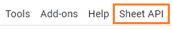
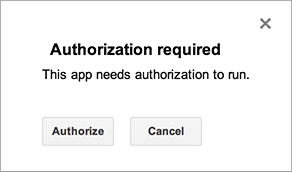

## Getting started

### Download the latest version

The latest release package is `sheet-api-v0.0.4.zip`. The release package contains 2 files that are `app-init.gs` and `app-v0.0.4.gs`.

### Creating a project from Google Sheets

Skip this step if you alread had a script project

- Open Google Sheets
- Select *Tools* > *Script editor*.
- Select *File* > *Save*.
- Enter the name of your project and click OK to save the project.

### Creating files

Skip step 1 & 2 if you are performing the upgrade

1. Select File > New > Script file to create a script file.
2. Enter `app-init.gs` for the name of the new file and click OK to create it.
3. Copy and paste the code of downloaded file `app-init.gs` into the script editor.
4. Repeat step 1, 2, 3 for file `app-v0.0.4.gs`.

### Authorization

Apps Script requires user authorization to access private data from built-in Google services or advanced Google services. Apps Script determines the authorization scopes (like access your Google Sheets files or Gmail) automatically, based on a scan of the code. 

- Back to Google Sheets apps
- Refresh page by pressing *F5*
- Select *Sheet API* > *Authorize* menu item.

- You'll see one of the authorization dialogs shown here when it is run.

### Deploy Sheet API

An Apps Script project deployment is a version of the script that is made available for use as a web app. A version is a numbered snapshot of your code. 

- In the script editor, select the *Publish* > *Deploy as web app...* menu item.
- Under *Project* version, select *New*.
- Under *Execute the app as*, select *Me*
- Under *Who has access to the app*, select *Anyone, even anonymous*
- Click *Deploy*.
- You'll see a new dialog with a message indicating that your project has been successfully deployed as a web app.
- The url labeled *Current web app URL* and ends in */exec*. This URL is for the published version of your app, based on the last version you saved and deployed. In Sheet API document, this url will be refered as *{script_url}*
